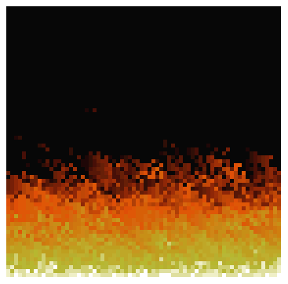

  <!-- <a href="https://filipedeschamps.github.io/doom-fire-algorithm/playground/1st-implementation-with-tables/"> -->
    
  <!-- </a> -->

# Doom Fire Algorithm
Fire effect from Doom at the upside down implemented in plain JavaScript and using a Table to render the final effect.

This project was inspired by [this article](http://fabiensanglard.net/doom_fire_psx/).
and [this video](https://www.youtube.com/watch?v=fxm8cadCqbs).

## Author

<!-- | [ @filipedeschamps](https://github.com/caduopm) | -->
| :---: |
